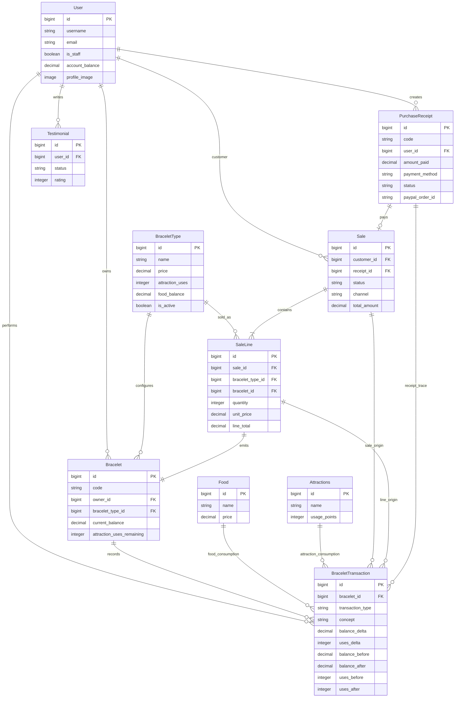
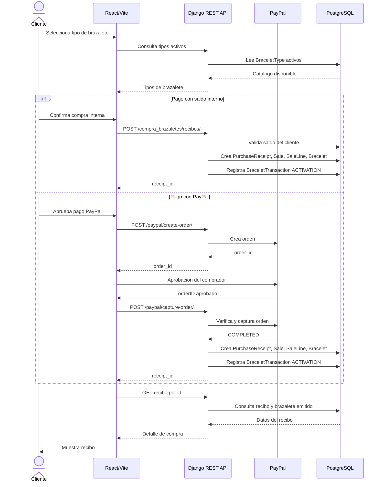
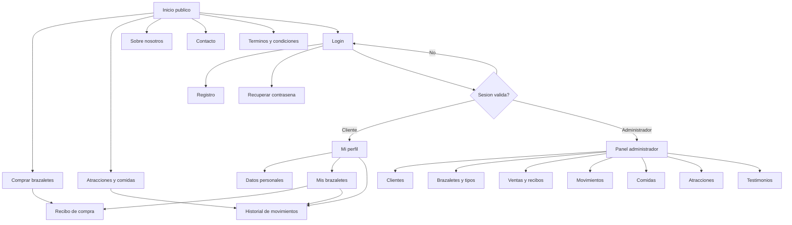
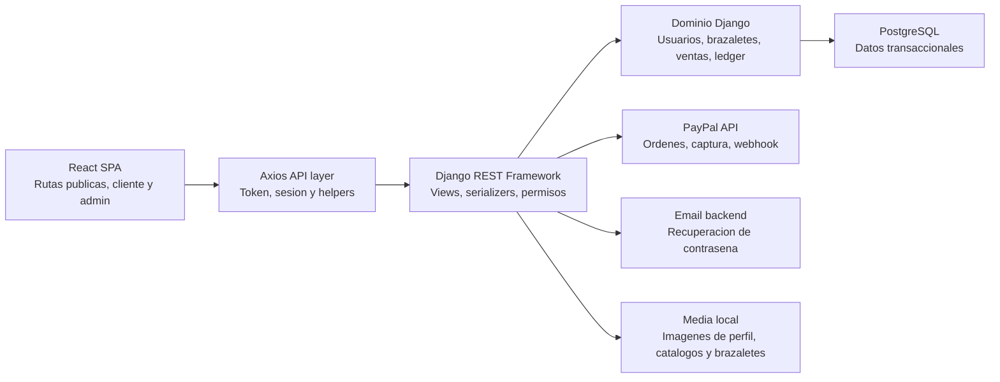

# Diagramas clave del sistema

## Objetivo

Reunir los diagramas principales del proyecto en un formato versionable y facil de revisar desde GitHub o cualquier visor compatible con Mermaid.

Estos diagramas resumen el estado actual del sistema, no la propuesta inicial. Para el detalle textual por capa, revisar:

- [backend-funcionamiento.md](backend-funcionamiento.md)
- [frontend-funcionamiento.md](frontend-funcionamiento.md)
- [modelo-transaccional-brazaletes.md](modelo-transaccional-brazaletes.md)

## Diagrama entidad-relacion principal

## Secuencia de compra de brazalete

## Navegacion principal

## Mapa de capas

## Notas de consistencia

- El frontend bloquea rutas por experiencia de usuario, pero la autorizacion definitiva esta en backend.
- La regla administrativa canonica es `is_staff`, expuesta al frontend como `is_admin`.
- `PurchaseReceipt` no reemplaza a `Sale`; el recibo representa pago y la venta representa negocio.
- `Bracelet.current_balance` y `Bracelet.attraction_uses_remaining` son estado actual materializado; el historial vive en `BraceletTransaction`.
- Las comidas y atracciones se consumen contra el brazalete, no como ventas nuevas de brazaletes.
