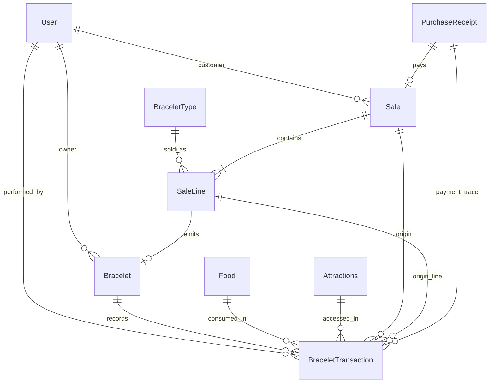

# Modelo transaccional para brazaletes, ventas y consumos

## Objetivo

Documentar el modelo de datos vigente para soportar:

- venta de brazaletes;
- detalle de lo vendido;
- movimientos operativos del brazalete;
- historial y auditoria;
- separacion clara entre compra, pago y consumo.

Este documento parte del estado real del proyecto y evita duplicar responsabilidades ya cubiertas por `PurchaseReceipt`.

## Contexto actual

Hoy el backend ya tiene estas piezas:

- `BraceletType`: catalogo comercial del brazalete;
- `Bracelet`: instancia creada al comprar, con propietario, saldo actual y usos restantes;
- `PurchaseReceipt`: comprobante de compra y pago;
- `Sale`: cabecera comercial de la venta;
- `SaleLine`: detalle del brazalete vendido;
- `BraceletTransaction`: ledger operativo del brazalete;
- `Food` y `Attractions`: catalogos operativos de servicios consumibles.

Referencias actuales:

- [backend/compra_brazaletes/models.py](/C:/Users/3st3b/Dev/brazaletes_web_agentes_IA/proyecto-brazaletes-web/backend/compra_brazaletes/models.py)
- [backend/atracciones_comidas/models.py](/C:/Users/3st3b/Dev/brazaletes_web_agentes_IA/proyecto-brazaletes-web/backend/atracciones_comidas/models.py)
- [docs/backend-funcionamiento.md](/C:/Users/3st3b/Dev/brazaletes_web_agentes_IA/proyecto-brazaletes-web/docs/backend-funcionamiento.md)

### Problema resuelto

Antes, `PurchaseReceipt` cargaba demasiada responsabilidad porque el sistema inferia desde el comprobante que se habia vendido y a quien pertenecia el brazalete.

El modelo vigente separa:

- comprobante de pago;
- hecho comercial de venta;
- detalle vendido;
- unidad de brazalete emitida;
- movimiento operativo del brazalete.

## Decision de diseno vigente

Se conserva `PurchaseReceipt` como comprobante de pago y se agregan tres piezas de dominio:

1. `Sale`: cabecera comercial de la venta.
2. `SaleLine`: detalle de la venta.
3. `BraceletTransaction`: ledger operativo e inmutable de cada movimiento del brazalete.

Tambien se hizo explicita la relacion entre brazalete y usuario agregando `Bracelet.owner`.

## Principio rector

La regla clave es esta:

- `PurchaseReceipt` responde "como se pago".
- `Sale` y `SaleLine` responden "que se vendio".
- `BraceletTransaction` responde "que le paso al brazalete despues o como consecuencia de eso".

Con esa separacion se evita que un mismo modelo cargue responsabilidades de pago, inventario logico, consumo y auditoria al mismo tiempo.

## Modelo vigente

### 1. `Bracelet`

Mantener `Bracelet` como la entidad viva del brazalete, pero con estos ajustes de dominio:

- agregar `owner` o `assigned_user` -> `ForeignKey(User, null=True, blank=True)`;
- conservar `current_balance` y `attraction_uses_remaining` como estado actual materializado;
- opcionalmente agregar `status` con valores como `ACTIVE`, `BLOCKED`, `REFUNDED`, `INACTIVE`.

### Responsabilidad

- representar el estado actual del brazalete;
- servir como punto de consulta rapido;
- no guardar el historial detallado de cambios.

## 2. `PurchaseReceipt`

Conservar el modelo actual y restringir su responsabilidad a comprobante de pago.

### Responsabilidad

- metodo de pago;
- referencia del proveedor externo como `paypal_order_id`;
- monto pagado;
- estado del pago (`PENDING`, `APPROVED`, `CAPTURED`, `REFUNDED`);
- fecha y trazabilidad financiera del cobro.

### No debe encargarse de

- detallar consumos;
- guardar cada movimiento operativo del brazalete;
- ser el unico lugar para inferir propiedad del brazalete;
- reemplazar la cabecera comercial de venta.

## 3. `Sale`

Nueva entidad para representar la operacion comercial.

### Campos vigentes

- `id`
- `customer` -> `ForeignKey(User)`
- `receipt` -> `OneToOneField(PurchaseReceipt)`
- `status` -> `PENDING`, `CONFIRMED`, `CANCELLED`, `REFUNDED`
- `channel` -> `INTERNAL_BALANCE`, `PAYPAL`
- `total_amount`
- `created_at`
- `confirmed_at`
- `created_by` -> usuario operador si aplica

### Responsabilidad

- agrupar la venta como hecho de negocio;
- ser el encabezado comun para recibo, detalle y brazalete generado;
- permitir reportes comerciales por fecha, cliente, canal y estado.

### Nota

Aunque hoy el flujo actual vende un solo brazalete por operacion, mantener `Sale` separado prepara el dominio para crecimiento sin deformar `PurchaseReceipt`.

## 4. `SaleLine`

Nueva entidad para representar el detalle de lo vendido.

### Campos vigentes

- `id`
- `sale` -> `ForeignKey(Sale, related_name="lines")`
- `bracelet_type` -> `ForeignKey(BraceletType)`
- `bracelet` -> `OneToOneField(Bracelet)`
- `quantity`
- `unit_price`
- `line_total`
- `initial_food_balance`
- `initial_attraction_uses`

### Responsabilidad

- capturar el detalle comercial del producto vendido;
- congelar la configuracion relevante al momento de la venta;
- vincular la linea con el brazalete efectivamente emitido.

### Regla practica vigente

La primera implementacion esta restringida a:

- `quantity = 1`;
- una linea por brazalete emitido.

Eso permite conservar la entidad `SaleLine` sin sobredisenar el flujo actual.

## 5. `BraceletTransaction`

Nueva entidad canonica para historial operativo del brazalete.

Este modelo sustituye la idea ambigua de una tabla generica llamada solo `Transacciones` y la aterriza como ledger del brazalete.

### Campos vigentes relevantes

- `id`
- `bracelet` -> `ForeignKey(Bracelet, related_name="transactions")`
- `owner` -> `ForeignKey(User, null=True, blank=True)`
- `sale` -> `ForeignKey(Sale, null=True, blank=True)`
- `sale_line` -> `ForeignKey(SaleLine, null=True, blank=True)`
- `receipt` -> `ForeignKey(PurchaseReceipt, null=True, blank=True)`
- `food` -> `ForeignKey(Food, null=True, blank=True)`
- `attraction` -> `ForeignKey(Attractions, null=True, blank=True)`
- `transaction_type`
- `concept`
- `balance_delta`
- `uses_delta`
- `balance_before`
- `balance_after`
- `uses_before`
- `uses_after`
- `performed_by` -> usuario operador o sistema
- `occurred_at`
- `reverted_transaction` -> para reversos o correcciones
- `metadata` -> `JSONField` para referencia externa, caja, terminal, ticket interno u observaciones

### Tipos de transaccion vigentes

- `ACTIVATION`
- `FOOD_CONSUMPTION`
- `ATTRACTION_CONSUMPTION`
- `ADMIN_ADJUSTMENT`
- `REVERSAL`

### Responsabilidad

- registrar cada cambio relevante del brazalete;
- dejar trazabilidad suficiente para auditoria;
- permitir reconstruir historial;
- soportar conciliacion entre venta, consumo y saldo actual.

### Regla de integridad

Los cambios del brazalete se hacen siempre en una transaccion atomica de base de datos:

1. se lee el estado actual del brazalete;
2. se valida saldo o usos disponibles;
3. se crea un `BraceletTransaction`;
4. se actualiza `Bracelet.current_balance` y `Bracelet.attraction_uses_remaining`.

Si falla cualquiera de esos pasos, no se debe persistir nada.

## Relaciones vigentes

## Flujo recomendado

### Compra de brazalete

1. el cliente inicia una compra;
2. se crea o confirma `PurchaseReceipt`;
3. se crea `Sale`;
4. se crea `Bracelet`;
5. se crea `SaleLine` vinculando tipo vendido y brazalete emitido;
6. se crea `BraceletTransaction` de tipo `ACTIVATION`;
7. se actualiza `Bracelet.owner`, `current_balance` y `attraction_uses_remaining`.

### Consumo de comida

1. se selecciona el brazalete;
2. se valida saldo disponible;
3. se crea `BraceletTransaction` de tipo `FOOD_CONSUMPTION`;
4. se descuenta saldo del brazalete.

### Uso de atraccion

1. se selecciona el brazalete;
2. se valida cantidad de usos restantes;
3. se crea `BraceletTransaction` de tipo `ATTRACTION_CONSUMPTION`;
4. se descuenta un uso o los puntos definidos por la atraccion.

### Ajuste manual o reverso

1. un operador autorizado genera el ajuste;
2. se crea una nueva `BraceletTransaction`, nunca se edita el historial anterior;
3. si corrige otra transaccion, se referencia en `reverted_transaction`;
4. si hace falta conservar contexto operativo, se guarda en `metadata`.

En el flujo administrativo vigente, editar el saldo o los usos restantes desde el endpoint de brazaletes crea automaticamente un `ADMIN_ADJUSTMENT`. La actualizacion del estado materializado del `Bracelet` y la escritura del movimiento ocurren en una misma transaccion atomica.

## Consultas operativas que ya quedarian soportadas

- historial completo de un brazalete por fecha;
- brazaletes activos de un usuario;
- total vendido por rango de fechas;
- ventas por canal de pago;
- consumos de comida por producto;
- ingresos y consumos asociados a un cliente;
- trazabilidad de quien hizo un ajuste;
- reconstruccion del saldo actual desde transacciones.

## Solape evitado entre modelos

### `PurchaseReceipt` y `Sale`

No se duplican si se mantiene esta frontera:

- `PurchaseReceipt` = evidencia del cobro;
- `Sale` = hecho comercial.

Una venta puede tener un recibo asociado, pero no debe desaparecer dentro del recibo.

### `SaleLine` y `BraceletTransaction`

No se duplican si se mantiene esta frontera:

- `SaleLine` = que se vendio;
- `BraceletTransaction` = que movimiento afecto al brazalete.

La activacion inicial del brazalete nace por una venta, pero sigue siendo un movimiento aparte y auditable.

## Reglas recomendadas de dominio

- el historial de `BraceletTransaction` es inmutable;
- los ajustes se corrigen con nuevas transacciones, no editando transacciones antiguas;
- `Bracelet.current_balance` y `Bracelet.attraction_uses_remaining` son cache del estado actual, no fuente historica;
- todo consumo debe referenciar exactamente un brazalete;
- si la transaccion es de comida, `food` debe venir informado;
- si la transaccion es de atraccion, `attraction` debe venir informada;
- el brazalete debe quedar vinculado directamente al usuario para evitar depender de joins indirectos via recibos.

## Estado de implementacion

### Implementado

- agregar `owner` a `Bracelet`;
- crear `Sale`;
- crear `SaleLine`;
- enlazar `PurchaseReceipt` con `Sale`.
- registrar `ACTIVATION` al comprar el brazalete;
- registrar consumo de comida y atracciones usando transacciones atomicas.
- permitir ajustes administrativos con `ADMIN_ADJUSTMENT`;
- auditar automaticamente ediciones administrativas de saldo y usos desde `BraceletViewSet`;
- permitir reversos con `REVERSAL` y `reverted_transaction`;
- conservar contexto operativo flexible mediante `metadata`.

### Pendiente futuro

- agregar endpoints administrativos dedicados para ejecutar ajustes/reversos y modificar el estado materializado del brazalete de forma atomica;
- incorporar restricciones y validaciones mas finas por tipo de transaccion;
- agregar reportes operativos.

## Decision final vigente

El modelo minimo vigente para este proyecto es:

- mantener `PurchaseReceipt`;
- usar `Sale`;
- usar `SaleLine`;
- usar `BraceletTransaction`;
- usar relacion directa `Bracelet -> User`.

Con esto se cumplen los criterios del requerimiento porque:

- existe una implementacion coherente entre compra, consumo y auditoria;
- las relaciones entre usuario, brazalete, venta y transaccion quedan explicitas;
- `PurchaseReceipt` conserva un rol claro y no se sobrecarga;
- el modelo soporta consultas operativas e historial sin perder simplicidad.
